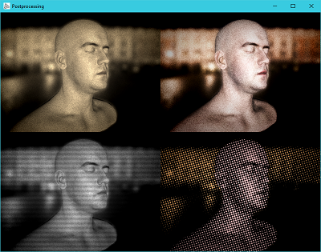

# Node.js 3D Core

This is a part of [Node3D](https://github.com/node-3d) project.

[](https://www.npmjs.com/package/3d-core-raub)

[](https://travis-ci.com/node-3d/3d-core-raub)
[](https://www.codefactor.io/repository/github/node-3d/3d-core-raub)

> npm i 3d-core-raub


## Synopsis

Launch **Node.js** in **WebGL** mode.



* Shipped together with [three.js](https://github.com/mrdoob/three.js) for convenience.
* Multiple windows are supported, with the help of [GLFW](http://www.glfw.org/).
* WebGL implementation is also using [GLEW](http://glew.sourceforge.net/).
* Image loading uses [FreeImage](http://freeimage.sourceforge.net/) encoder/decoder.
* Window icons are supported and both JS- and Image-friendly.

> Note: this package uses a bunch of **N-API addons**, which are ABI-compatible across
different Node.js versions. Addon binaries are precompiled and **there is no compilation**
step during the `npm i` command.


## Usage

This module directly exports only one function - `init()`. Call it with or without
custom options to start with the first window and acquire all the features.

```
const init = require('3d-core-raub');
const { Screen, Brush, loop } = init(); // no opts is fine too

const screen = new Screen();
loop(() => screen.draw());

const brush = new Brush({ screen, color: 0x00FF00 });
screen.on('mousemove', e => brush.pos = [e.x, e.y]);
```

### init(opts = {})

Initialize Node3D. Creates the first window and sets up the global environment.
This function can be called repeatedly, but will ignore further calls.
The return value will be the same for any number of repeating calls.

Parameter `opts` and all of its fields are optional:

* `number major 2` - major OpenGL version to be used.
* `number minor 1` - minor OpenGL version to be used.
* `string title $PWD` - window title, takes current directory as default.
* `number width 800` - window initial width.
* `number height 600` - window initial height.
* `number display undefined` - display id to open window on a specific display.
* `boolean vsync false` - if vsync should be used.
* `string mode 'windowed'` - one of `'windowed', 'borderless', 'fullscreen'`.
* `boolean autoIconify true` - if fullscreen windows should iconify automatically on focus loss.
* `number msaa 2` - multisample antialiasing level.
* `boolean decorated true` - if window has borders (use `false` for borderless fullscreen).
* `webgl` - override for module "webgl-raub".
* `Image` - override for module "image-raub".
* `glfw` - override for module "glfw-raub".
* `location` - override for `window.location`.
* `navigator` - override for `window.navigator`.
* `WebVRManager` - override for `window.WebVRManager`.
* `three`, `opts.THREE` - override for module "three".
* `[{search,replace}] shaderHacks` - a list of shader replacement rules. Each rule is later
	translated into a call of
	[String.replace()](https://developer.mozilla.org/en-US/docs/Web/JavaScript/Reference/Global_Objects/String/replace)
* `[string|function|{name,opts}] plugins` - a list of plugins to initialize.
	Plugins are inited the very last. Right before the result of `init()` is returned.
	Given the name of the plugin `init()` will try to require it and call it passing
	the future-return-value. Plugins are inited in the same order as they present in the
	array. You may also pass the plugin as a function, which is equivalent to a manual
	call `plugin(initResult)`, where `initResult` is what `init()` returns. Yet even
	in this case using the array parameter allows shorter syntax and order control.
* `Object extend` - extend or override the returning fields.


Returns:

* `class Image` - Almost the same as `Image` in a browser. Also `document.createElement('img')`
	does the same thing as `new Image()`. For more info see
	[the respective docs of image-raub](https://github.com/node-3d/image-raub#image-for-nodejs).
* `class Window` - This constructor spawns a new platform window.
	For more info see
	[the respective docs of glfw-raub](https://github.com/node-3d/glfw-raub#class-window).
* `class Document` - This constructor spawns a new platform window **with a web-document like interface**.
	For more info see
	[the respective docs of glfw-raub](https://github.com/node-3d/glfw-raub#class-document).
* `gl`, `webgl`, `context` - A WebGL context instance. This is almost the same as real WebGL stuff.
	For more info see
	[the respective docs of webgl-raub](https://github.com/node-3d/webgl-raub#webgl-for-nodejs).
* `glfw` - Low level GLFW interface. For more info see
[the respective docs of glfw-raub](https://github.com/node-3d/glfw-raub#glfw-for-nodejs).
* `doc`, `canvas`, `document`, `window` - The default instance of Document.
	It is used to immediately initialize three.js.
	This implies, that (the first occurance of) `require('node-3d-core-raub')`
	results in a new platform window being immediately created.
* `three`, `THREE` - An instance of three.js. For more info see
	[the respective docs of three.js](https://github.com/mrdoob/three.js/#threejs).
* `loop` - A convenience shortcut to induce `requestAnimationFrame`-driven render loop.
Function `cb` is called, whenever the default document is ready to produce a new
frame. The function is **BOUND** to the default document instance.
* `requestAnimationFrame`, `frame` - What is known as `window.requestAnimationFrame`.
Function `cb` is called, whenever the default document is ready to produce a new
frame. The function is **BOUND** to the default document instance.
* `class Brush` - Creates a screen-sized overlay, where a circle is drawn around the
	specified position.
* `class Cloud` - Base class for custom-VBO based geometries.
* `class Drawable` - Base class for all drawable classes exported by this module.
* `class Points` - A custom-VBO based point-cloud.
* `class Lines` - A custom-VBO based line-cloud.
* `class Tris` - A custom-VBO based triangle-cloud.
* `class Rect` - A single rectangle. Probably supports corner-radius
* `class Screen` - A further abstraction of `Document`, encapsulating some
	three.js-specific logics.
* `class Surface` - A Rect that mimics a `Screen` for drawable objects.
* `...` - whatever is added by plugins or the `opts.extend` parameter.


## Plugins

By definition here:
* A plugin needs some of the fields returned by `init()`.
* The core "does not know" about any specific plugins.
* Plugins do not have `3d-core-raub` in their dependencies.

Pros:
* You can run a plugin against a fork of `3d-core-raub`.
* Plugins won't ever try to load 2 different **glfw3.dll** comming from different
	dependency versions.
A plugin may always be replaced by its fork.

Cons:
* You have to manage the compatibility between the core and the plugins manually (now).


```
module.exports = core => {
	// ...
	// core.something = something;
}
```
